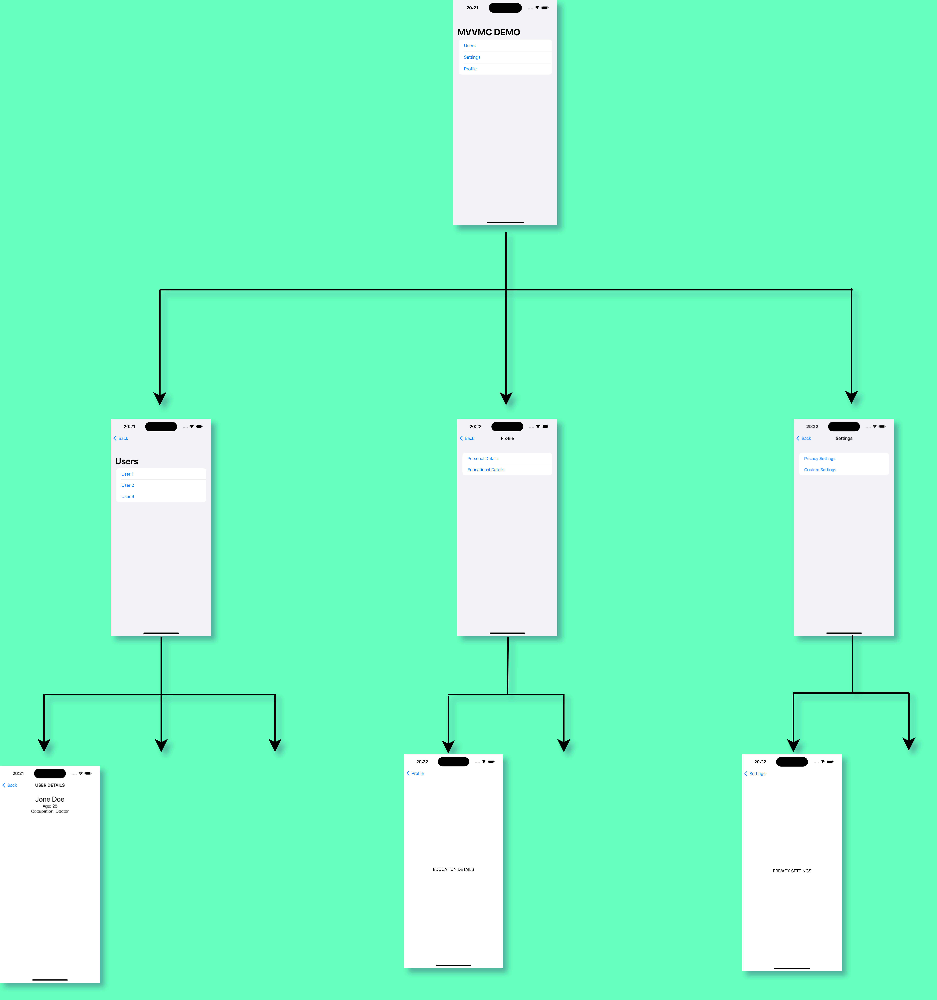
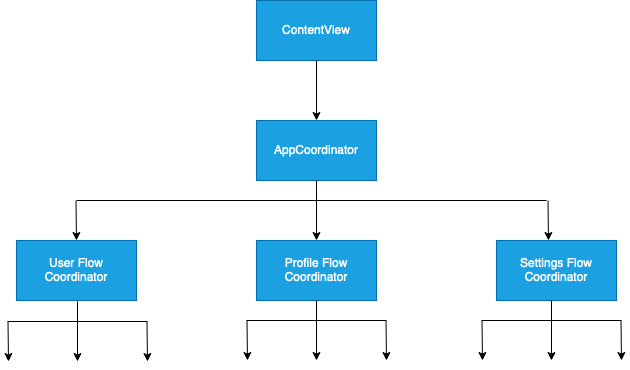

# MVVMC-SwiftUI
Ever since SwiftUI was introduced, It's been a struggle to build MVVM-C using SwiftUI. The whole idea behind introducing MVVM-C over MVVM to separate app's routing logic from the view layer. In UIKit we can do it perfectly since we can scratch the UINavigationController out of the ViewController and use it separately. But this isn't possible with SwiftUI hence the view and the Navigation are hardly bound together. 
 

But after SwiftUI has introduced updates to [NavigationStack using new NavigationPath](https://medium.com/r/?url=https%3A%2F%2Fswiftwithmajid.com%2F2022%2F10%2F05%2Fmastering-navigationstack-in-swiftui-navigationpath%2F) variable on iOS 16 onwards, we have some flexibility to separate NavigationStack from the view on SwiftUI as well. This update allows us to implement UIKit like Coordinator pattern on our SwiftUI projects.

## Full Medium Article
There is a medium article which has explained steip by step implementation of this project.
 
[Click here to read the full article](https://medium.com/@katramesh91/how-to-build-uikit-like-mvvm-c-coordinator-hierarchy-with-swiftui-d758b035f91a)

## App Overview
  

## Navigation Flow

  